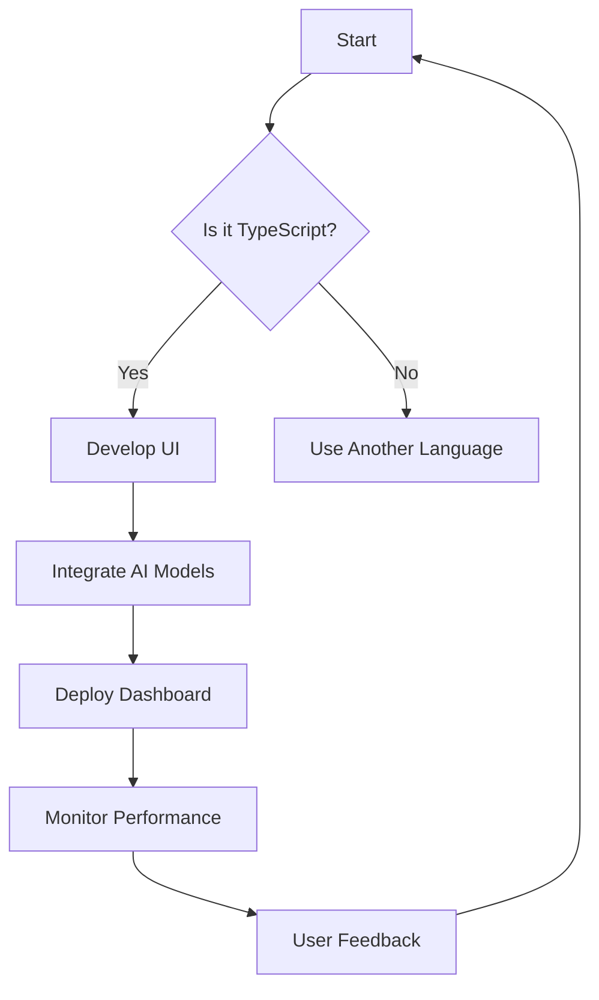

```mermaid
  graph TD;
      A[Start] --> B{Is it TypeScript?};
      B -- Yes --> C[Develop UI];
      B -- No --> D[Use Another Language];
      C --> E[Integrate AI Models];
      E --> F[Deploy Dashboard];
      F --> G[Monitor Performance];
      G --> H[User Feedback];
      H --> A;
```